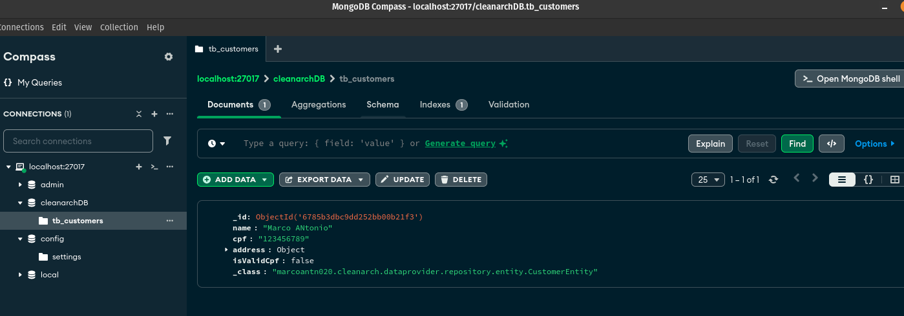

## Aplicando conceitos de arquitetura limpa
###### Crud de cliente com endereço, endereço sendo uma api externa com json webserver e com kafka para validar se o cpf é valido

### Requisitos
- java versão 17
- node 22.5.1
- docker e docker-compose

abra o terminal dentro do projeto
```
cd docker
docker-compose up -d
```
execute a api de endereço
```
cd api-address
npm install
npm run dev
```
[Api Address](http://localhost:3000/address)

<hr>

### execute o projeto usando a idea(Intellij)

#### acesse o swagger
[Swagger - CRUD Clean Arch](http://localhost:8080/swagger-ui/index.html#/)


### Caso queira ver os dados no Mongo é necessario ter o MongoDB Compass instalado
[MongoDB Compass](https://www.mongodb.com/try/download/compass)



### Para publicar uma mensagem no kafka no intellij instale o plugin "KAFKALYTIC"
- para configurar o acesso ao kafka siga os passos abaixo:


<hr>


- Crie dois topico clicando com o botao direito do mouse em cima de topics e clique em create topic depois basta fazer um refresh
 ` "tp-cpf-validate" 
   "tp-cpf-validation"`

- para publicar uma mensagem siga os passos abaixo:
- clique com o botao direito do mouse em cima do topico "tp-cpf-validate"
- clique em "Publish single message" cole o json abaixo 
- faça uma request do tipo get passando o `customerId` que usou para publicar a messagem, o validCpf deve estar com valor **TRUE**
```
{
  "customerId": "6785acabbdcb0910632a39a4",
  "name": "Maria Antonieta",
  "cpf": "12345678909",
  "zipcode": "12345001",
  "validCpf": true
}
```

## Modelo
